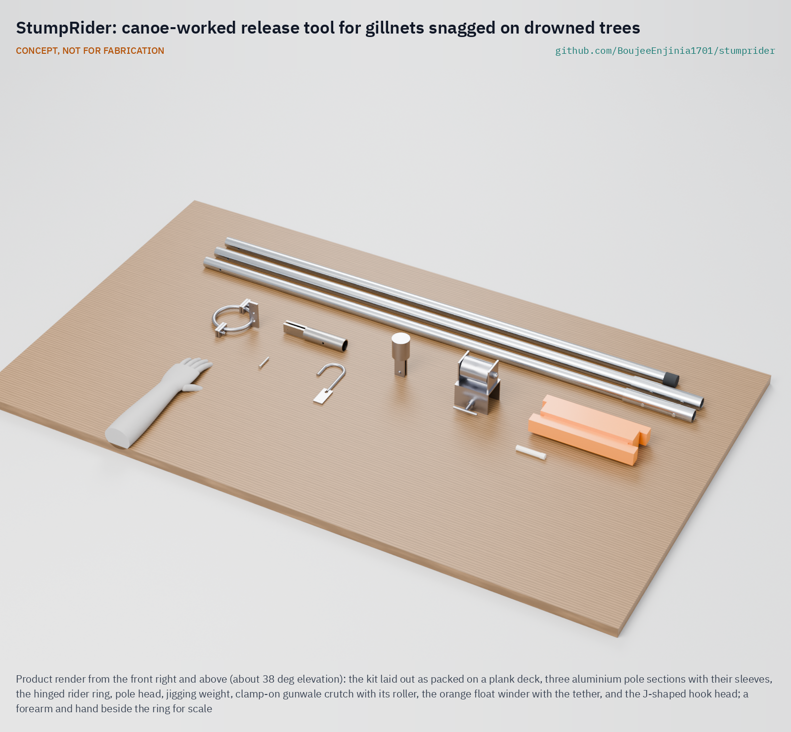
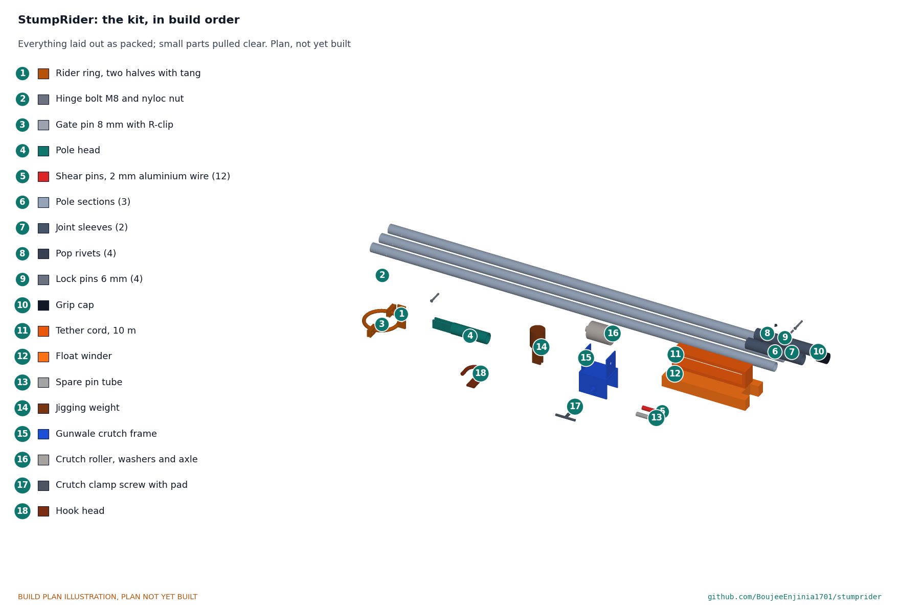

# StumpRider

   

**Area:** Food and water security · **TRL:** 3 of 9 (proof of concept on paper) · **Value-engineering target:** USD 2,000 for the prototype work (estimated cost of the constructable design USD 292.50 for three kits) · **Difficulty:** 2 of 5

Frees gillnets snagged on submerged trees from the canoe so children are not sent to dive.

> CONCEPT, NOT FOR FABRICATION. StumpRider is a TRL 3 design on paper: it has not been built or tested, it is not certified equipment, and it never replaces a life jacket.

## Concept rationale

StumpRider is a release tool worked entirely from the canoe. A ring clips around the net line and slides down it onto the snag. The fisher pushes and works the ring with a pole until the net lifts clear of the branch. A shear pin in the pole head breaks at a set load, so a hard pull cannot capsize the canoe or tear the mesh; the pin is replaced and the fisher tries again from a different angle.

The design is deliberately simple: a hinged steel ring, a three-piece pole, a soft aluminium pin and some cord, all of which a village workshop can make and repair. The aim is not to improve the catch but to remove the one task that puts a child underwater. It is published as an open engineering reference so that NGOs, fisheries officers and boat builders can make it locally.

## Burning platform

Lake Volta in Ghana was formed over a flooded forest. It holds about 14 million cubic metres of submerged hardwood, and many trunks lurk just below the surface, where they snag fishermen's nets and hole canoes; stumps were the leading cause of documented boat accidents on the lake from 1990 to 2011, at 38 % ([Underwater timber harvesting on the Volta Lake, WMU](https://commons.wmu.se/cgi/viewcontent.cgi?article=1009&context=all_dissertations)). Child labour studies list the task directly: children dive into deep water to disentangle fishing nets from tree stumps, and small children have drowned doing it ([Analytical study on child labour in Lake Volta fishing, ILAB](https://www.dol.gov/sites/dolgov/files/ILAB/CHILD%20LABOUR%20IN%20VOLTA%20LAKE%20FISHING%20STUDY%20REPORT%20-%20FINAL%20REPORT.pdf)).

A 2024 prevalence study found that 15 % of children working in Lake Volta fishing reported diving underwater to retrieve nets, 37.7 % were likely victims of trafficking, and 5.1 % of parents and caregivers knew of a child who had died working on the lake ([IJM, 2024](https://ijmstoragelive.blob.core.windows.net/ijmna/documents/studies/2023-Fishing_Prevalence_Study_Report.pdf)). Enforcement and rescue matter most, but as long as nets snag, somebody is sent down. A tool that frees the net from the surface takes away the reason to send a child.

## Where it could be used

### By industry

| Industry | Use |
| --- | --- |
| Inland capture fisheries | Freeing gillnets and set lines snagged on drowned trees in reservoirs and lakes |
| Child protection and anti-trafficking programmes | A practical tool to hand out alongside rescue and awareness work, so boat owners have no excuse to send a child to dive |
| Fisheries extension and co-management | Safe-practice kits distributed through fisher associations and landing-site committees |
| Reservoir and dam operators | A low-cost measure for fishing communities on impoundments where forest was left standing |
| Recreational and research netting | Recovering survey nets and sampling gear from snag-rich water without divers |

### By country or region

| Country or region | Why it matters there |
| --- | --- |
| Ghana (Volta Lake) | About 14 million cubic metres of submerged trees snag nets and hole canoes ([WMU](https://commons.wmu.se/cgi/viewcontent.cgi?article=1009&context=all_dissertations)), and 15 % of children in the lake fishery report diving to retrieve nets ([IJM, 2024](https://ijmstoragelive.blob.core.windows.net/ijmna/documents/studies/2023-Fishing_Prevalence_Study_Report.pdf)). |
| Ghana (national) | An ILAB-funded study estimated over 49,000 children involved in fishing in Ghana, 87 % of them boys ([ILAB](https://www.dol.gov/sites/dolgov/files/ILAB/CHILD%20LABOUR%20IN%20VOLTA%20LAKE%20FISHING%20STUDY%20REPORT%20-%20FINAL%20REPORT.pdf)). |
| Zambia and Zimbabwe (Lake Kariba) | A large inshore gillnet fishery on a dammed reservoir, with around 1,200 fishers on the Zambian side by 1999 ([FAO](https://www.fao.org/4/y5056e/y5056e03.pdf)); whether snags drive diving there is an open question. |
| Low- and middle-income countries generally | Small-scale fisheries produce about 99.7 % of inland fisheries output and about 60 million people work in small-scale fishing ([Nature](https://www.nature.com/articles/s41586-024-08448-z)), so a hand tool that works in snag-rich water has a wide potential reach. |

## What sparked the idea

The idea came from the story of Foli, a boy enslaved on Lake Volta who was forced to dive into dark, murky water to untangle nets that caught on branches below the surface, even though he could not swim, until IJM social workers and local authorities took him off the canoe and arrested the boat master ([IJM](https://www.ijm.org/stories/foli)). The net had to come free somehow; the question was whether it could come free without a child going under.

## Problem

On lakes with drowned forests, gillnets catch on submerged trees and boat masters send children down to free them, sometimes children who cannot swim. Fishers have no simple tool that frees a snagged net from the canoe.

Full problem statement: [docs/01-problem.md](docs/01-problem.md)

## Concept

A release tool worked from the canoe that slides a ring down the net line onto the submerged snag and frees the gillnet with a pole and a shear pin, so fishers stop sending children to dive for it.

Full design precis: [docs/02-concept.md](docs/02-concept.md) · Requirements: [docs/03-requirements.md](docs/03-requirements.md) · Calculations: [docs/04-calcs/01-sizing.md](docs/04-calcs/01-sizing.md) · Prototype build plan: [docs/05-build-plan.md](docs/05-build-plan.md) · Design decisions: [docs/06-design-decisions.md](docs/06-design-decisions.md)

## Key components

- Rider ring: two hinged half rings of 12 mm steel bar, 100 mm inside, closed by a pinned gate
- Three-piece aluminium push pole, 4.18 m from the top hand to the ring, packing to 1.55 m
- Pole head with a fork over the ring's tang and a 2 mm soft aluminium shear pin (about 300 N)
- Spare shear pins from one calibrated reel
- 10 m tether cord on an orange foam float winder
- Jigging weight that pins to the ring for snags beyond pole reach
- Clamp-on gunwale crutch with a roller for the net line

## Building the prototype

The [prototype build plan](docs/05-build-plan.md) (SMR-BLD-001, plan, not yet built) is written for a village smith. It covers the kit component by component, with making sketches for the ten made parts, close-ups of nine joints and a picture for each of eleven assembly steps. The steel parts are bent, cut, drilled and stick-welded, then galvanised; the pole is cut and drilled aluminium tube; everything is made in about a working day. No kit is used on a snag before its pin wire is calibrated on CalRig and a moored heel test shows the canoe stays within 5 deg, which is TRL 4 work.

## Safety

> Published as an open engineering reference, not certified equipment.
>
> The tool exists so that nobody enters the water; it must never be presented as a reason to keep children on boats.
>
> Crew wear life jackets while working a snag; the tool never replaces a life jacket.
>
> The shear pin is a safety device: always use the rated pin, never a nail or bolt substitute.
>
> Stop and cut the net rather than risk a capsize.
>
> The shear pin protects a canoe of about 8 m with three crew; it does not protect small dugouts. The interim rule is lettered on the pole head: the tool is used only from canoes of 7 m or longer with three crew until heel tests by canoe class set a pin for smaller canoes, and the operator kneels.
>
> This design is published as an open engineering reference. It is not certified equipment.

## Repository layout

| Folder | Contents |
| --- | --- |
| `docs/` | Problem, concept, requirements, calculations and design decisions |
| `cad/src/` | build123d Python source, the source of truth for all geometry |
| `cad/step/`, `cad/stl/` | Exported models for FreeCAD, other CAD tools and printing |
| `cad/drawings/` | 2D sketches and dimensioned drawings |
| `bom/` | Bill of materials |
| `electronics/` | KiCad schematics and PCB layouts |
| `firmware/` | Microcontroller code |
| `media/` | Renders, perspectives and photos |
| `build-log/` | Dated prototyping notes |

## Documentation

Controlled documents follow the portfolio [documentation standard](.kit/STANDARDS.md). Each carries a document ID (SMR-PRC-001 for the precis), a version and a revision history. Branded PDFs are built with `python .kit/render.py` and attached to GitHub Releases when a document is tagged, for example `SMR-PRC-001/v1.0`.

## Credits

Designed by Amish Chadha at Design Molecule Labs. See [CONTRIBUTORS.md](CONTRIBUTORS.md) for roles. To cite this design, use [CITATION.cff](CITATION.cff) (GitHub shows it as "Cite this repository").

AI assistance (Claude) was used to accelerate prototype documentation and first-pass research. Design direction and all decisions are Amish Chadha's, recorded in this repository's decision records (`docs/decisions/`).

## Licenses

- **Hardware** (CAD, drawings, BOM, electronics): [CERN-OHL-S v2](LICENSE)
- **Software** (firmware, scripts, notebooks): [MIT](LICENSE-SOFTWARE)

A project of the [Design Molecule](https://designmolecule.com) lab.
