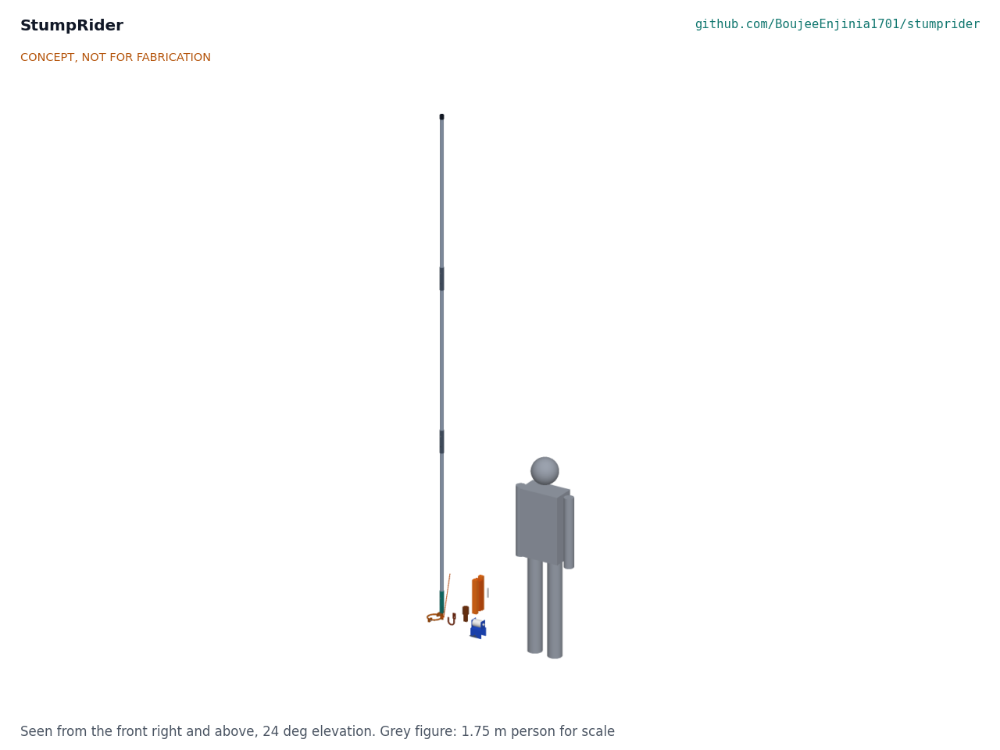

# StumpRider design precis

Frees gillnets snagged on submerged trees from the canoe so children are not sent to dive.

*Figure 1. The kit (concept render, CONCEPT, NOT FOR FABRICATION).*

> **Safety:** StumpRider exists so that nobody enters the water. It must never be presented as a reason to keep children on boats, and it never replaces a life jacket. Working a snag pulls the canoe over; the shear pin breaks before the pull can heel the design canoe more than about 4 deg, but small dugouts are not covered (see Safety). Stop and cut the net rather than risk a capsize.

## How it works

The crew pulls the net line up over the gunwale crutch and holds it taut above the snag. The operator, kneeling near the bow, opens the gate of the rider ring, closes the ring round the line and pushes it down the line with the jointed pole until it seats on the branch. The crew then slackens the line and the operator lifts, twists and pushes the ring along the branch until the mesh lifts clear. The pole head grips the ring by a fork on a tang, joined only by a 2 mm soft aluminium shear pin; if the pull or push goes above about 300 N (67 lbf), the pin breaks and the pole comes away. The ring stays on the net line and is recovered on its tether cord, a new pin is fitted, and the operator tries a different angle. For snags beyond the pole's reach, the pole head is taken off, the jigging weight is pinned to the tang in its place, and the ring is run down the line on its tether and jigged, as angling retrievers do.

## Components

*Table 1. Components (numbers are BOM lines in `bom/bom.csv`).*

| # | Component | Role | Made or bought |
| --- | --- | --- | --- |
| 1 | Rider ring | Two half rings of 12 mm steel bar, 100 mm inside, with ears at each joint and a tang on the fixed half; closes round the net line and slides down it | Made: bent, welded, galvanised |
| 2 | Hinge bolt | M8 bolt with a nyloc nut; the swinging half turns on it | Bought |
| 3 | Gate pin | 8 mm clevis pin, R-clip and lanyard; the only part removed to open the ring | Bought |
| 4 | Pole head | Steel socket on the pole with a fork that straddles the tang | Made: welded, galvanised |
| 5 | Shear pins | 2.0 mm soft aluminium wire, 30 mm long; the safety link between fork and tang | Made: cut from one calibrated reel |
| 6 | Pole sections | Three 1.45 m lengths of 32 x 2 mm aluminium tube | Made: cut and drilled |
| 7 | Joint sleeves | 200 mm of 38 mm tube riveted on the lower section of each joint | Made |
| 8 | Pop rivets | Fix the sleeves | Bought |
| 9 | Lock pins | 6 mm clevis pins at the two joints, the head and the jigging weight | Bought |
| 10 | Grip cap | Rubber cap on the top of the pole | Bought |
| 11 | Tether cord | 10 m of 6 mm braided polyester, tied to the tang | Bought |
| 12 | Float winder | Closed-cell foam winder that floats the ring and cord if dropped | Made |
| 13 | Spare pin tube | Keeps eleven spare pins dry | Bought |
| 14 | Jigging weight | 1.1 kg steel weight pinned to the tang for snags beyond pole reach | Made: welded, galvanised |
| 15 | Gunwale crutch frame | Steel saddle clamped on the gunwale, with cheeks for the roller | Made: bent, welded, galvanised |
| 16 | Crutch roller and axle | HDPE roller on an M12 bolt; the net line runs over it | Made and bought |
| 17 | Crutch clamp screw | M10 screw with a pad; clamps gunwales 30 to 60 mm thick | Made |

## Key design choices

Each choice was made under Amish's 2026-10-03 pre-approval and is argued in SMR-DDR-001 (TRL 2 review) and SMR-DDR-002 (design for construction); the register is SMR-DEC-001.

- **A hinged ring, not a spring clip.** Two half rings on a hinge bolt, closed by a pinned gate. Nothing springs or corrodes shut, and the ring opens wide enough for any line from 4 to 16 mm.
- **The shear pin is the only link between pole and ring.** The tang never reaches the end plate (45 mm clear), so push and pull both go through the pin, and twisting goes through the fork cheeks bearing on the tang, not the pin.
- **One pin rating, set by the canoe.** 2.0 mm soft aluminium wire in double shear, 302 N nominal; the band allowed by R3 (256 to 347 N) is checked by breaking ten pins from each reel on CalRig before use.
- **Aluminium pole for the prototype.** It is uniform, so the trials measure the tool and not a piece of bamboo. A local production variant with bamboo sections and a crutch and weight shared by five canoes is costed (`bom/bom-local-variant.csv`, about USD 56 a kit) and built alongside the prototype at TRL 4 (SMR-DDR-003).
- **Hook head for wrapped nets.** A J hook on a flat that pins into the same fork with the same shear pin, to draw the bight of a wrapped net back round the branch; tried beside the ring at TRL 4 (SMR-DDR-003).
- **The jigging weight pins to the tang.** A weight loose on the cord would not move the ring; pinned on, it makes the ring heavy enough to jig on the tether.
- **Clamp-on crutch.** It fits any gunwale from 30 to 60 mm thick without drilling the canoe.

## First-order numbers

All from SMR-CAL-001 (`docs/04-calcs/sizing.py`, results in `docs/04-calcs/results.csv`); estimates on stated assumptions, not test results.

*Table 2. Key figures.*

| Quantity | Value | Assumption |
| --- | --- | --- |
| Shear pin rating | 302 N nominal (256 to 347 N) | Soft aluminium wire, 48 MPa in shear, double shear |
| Pull to lift a hooked net | 81 to 126 N | Half a turn on the branch, friction 0.3 to 0.5, crew slackens to 30 N |
| Pull to lift a net wrapped once round | 368 N to 2.3 kN | Same, one and a half turns: above the pin, so it must be worked round first, with the ring or the hook head |
| Design canoe heel when the pin breaks | 3.4 deg kneeling, 4.4 deg standing | 8 m plank canoe, three crew, 550 kg; pin at the top of its band |
| Small dugout heel when the pin breaks | 24 deg kneeling | 5.5 m dugout, two crew, 280 kg |
| Top hand to ring | 4.18 m | Hands 300 mm below the top of the pole |
| Ring depth reached with the pole | 3.2 m | Pole 20 deg off vertical, operator kneeling |
| Tether reach, jigging | 8 m | 10 m cord, 2 m kept above the water |
| Pole buckling factor | 2.2 | Euler, 4.35 m, pinned ends, against 347 N |
| Kit carried in the canoe | 4.22 kg with the hook head (working tool 3.7 kg) | Crutch left on the canoe, jigging weight at the landing |
| Parts cost of one kit | USD 95.50 (local production variant USD 55.90) | Prototype prices, single kit |

## Patent design-arounds

From the preliminary patent, trademark and prior-art screen (not legal advice), kept unchanged:

- The sliding-ring release is public prior art (US3464138A, expired); keep to a plain split ring and publish our own shear-pin value rather than copying a retail retriever.
- State the child-labour context factually and with sources, without naming individual boat owners or communities.

## Shared blocks

- CalRig proof-load: calibrates each reel of pin wire (ten pins must break within 256 to 347 N).
- LevelHull canoe stability data, where available: replaces the assumed design canoe in the heel check.

## Safety

> **Safety:** These hazards apply to every use and every test of the tool.

- **Nobody enters the water.** The tool is never a reason to keep children on boats; it is handed out only with child-protection work (SMR-DDR-001, D9).
- **Capsize.** The pin limits the pull; in the design canoe it breaks at about 4 deg of heel. In a small dugout the same pin would let the canoe heel about 24 deg, so the interim rule, lettered on the pole head, keeps the tool to canoes of 7 m or longer with three crew. At TRL 4, heel tests by canoe class set a pin diameter per class; small canoes are served only once a measured pin suits them (SMR-DDR-003).
- **Life jackets** are worn by every person on the canoe while a snag is worked.
- **Use the rated pin only.** Never a nail, bolt or steel wire: a stronger pin removes the protection.
- **Sudden release.** When the pin breaks the operator falls back into the canoe; kneel, never stand, and keep the other crew clear of the pole top.
- **Cut, do not risk it.** If the net will not come free, cut it.

This design is published as an open engineering reference. It is not certified equipment.

## Open questions

Open questions are kept in the design decisions register (SMR-DEC-001): Amish decided R1, R3, R7 and R10 on 2026-10-03 (SMR-DDR-003); the questions left open are R7 for the aluminium prototype and R9 at its limit, and the items to confirm when parts are bought.
