# StumpRider prototype build plan

**Plan, not yet built.** How to build the first proof-of-concept StumpRider kit, component by component. Building and testing to it is TRL 4 work. Decisions still to be made are kept in the design decisions register (`docs/06-design-decisions.md`), not here.

> **Safety:** StumpRider exists so that nobody enters the water. Nothing in this plan, including the first checks, puts a person in the water. The shear pin is the safety device: fit only pins from a reel that has passed the calibration in section 5, never a nail, bolt or steel wire. On the water, every person wears a life jacket, the operator kneels, and the crew cuts the net rather than risk a capsize. The tool is used only from canoes 7 m or longer with at least three crew; a smaller canoe class is served only once a heel test has set a pin for it. Welding and galvanised steel give off fumes: weld in the open and never weld galvanised parts.

## 1. What you are building

*Figure 1. The kit, numbered in build order.*

The kit is a release tool for a gillnet snagged on a drowned tree. A hinged steel ring closes round the net line and is pushed down onto the snag by a three-piece aluminium pole; the pole holds the ring by a fork and a thin aluminium shear pin that breaks before the pull can heel the canoe too far. A tether on a floating winder brings the ring back, a pinned-on weight works snags too deep for the pole, and a clamp-on crutch with a roller guides the net line over the gunwale. A hook head that fits the same fork pulls a net that has wrapped round a branch back round it. There are 18 components: eleven are made (the ring, pole head, shear pins, pole sections, sleeves, float winder, jigging weight, crutch frame, roller, clamp screw and hook head) and seven are bought (bolts, pins, rivets, cap, cord and a small tube). The steel parts are bent, cut, drilled and welded with a stick welder and then hot-dip galvanised; the aluminium parts are cut and drilled. The parts for one kit cost about USD 96 at prototype prices.

The crutch stays clamped on the canoe as a fitting, and the jigging weight stays at the landing until a deep snag needs it, so the kit carried to and from the canoe weighs about 4.3 kg. A bamboo local variant (section 3.12) uses three treated bamboo culms joined by steel ferrules in place of the aluminium pole; everything else is the same, and one crutch and weight serve five canoes at a landing. It carries about 3.9 kg and its parts cost about USD 55 a kit. One bamboo pole is built alongside the aluminium kits so the two can be compared.

## 2. What changed to make it buildable

*Table 1. Changes from the concept (all recorded in SMR-DDR-002).*

| Component | The concept had | The buildable design has | Why |
| --- | --- | --- | --- |
| Rider ring | A split ring closed by a captive pin | Two half rings with ears at both joints: a bolt hinge on one side, a pinned gate on the other | A ring with a pin across a gap cannot open wide enough to take a line |
| Pole head and ring | A pole head with a shear pin | A steel socket and fork on the pole; a tang welded on the ring; the pin passes through fork and tang; the tang stops 45 mm short of the socket | Push and pull both go through the pin; twisting bears on the fork |
| Pole | Two or three sections | Three 1.45 m sections; riveted sleeves with lock pins | Packs to 1.55 m; joints cannot pull apart |
| Jigging weight | A weight used on the tether cord | A weight that pins to the ring's tang in place of the pole | A weight loose on the cord would not move the ring |
| Gunwale crutch | A roller or crutch | A clamp-on steel saddle with a plastic roller | Fits gunwales 30 to 60 mm thick without drilling the canoe |
| Tether and float | Cord and float | A bowline through the tang; a notched foam winder | A defined tie; the float holds the ring and cord |
| Hook head (SMR-DDR-003) | No tool for a wrapped net | A steel J hook on a flat that pins into the same fork with the same shear pin | A net wrapped round a branch needs more pull than the pin allows until it is worked back |
| Bamboo local variant (SMR-DDR-003) | Aluminium pole only | Three treated bamboo culms with steel ferrules, beside the aluminium prototype | Lighter and cheaper where bamboo grows; one crutch and weight shared by five canoes |

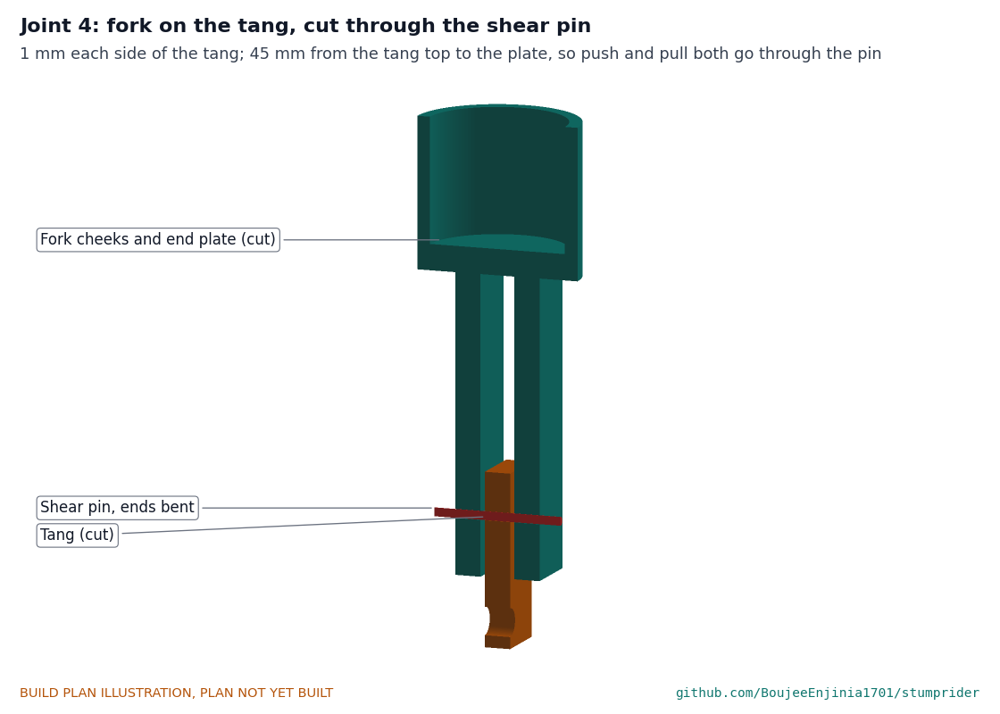

*Figure 2. The change that matters most: the shear pin is the only link between the pole and the ring.*

## 3. Making the components

Sizes are in millimetres. Weld only bare steel; galvanise after all welding and drilling of a part is done.

### 3.1 Rider ring (1)

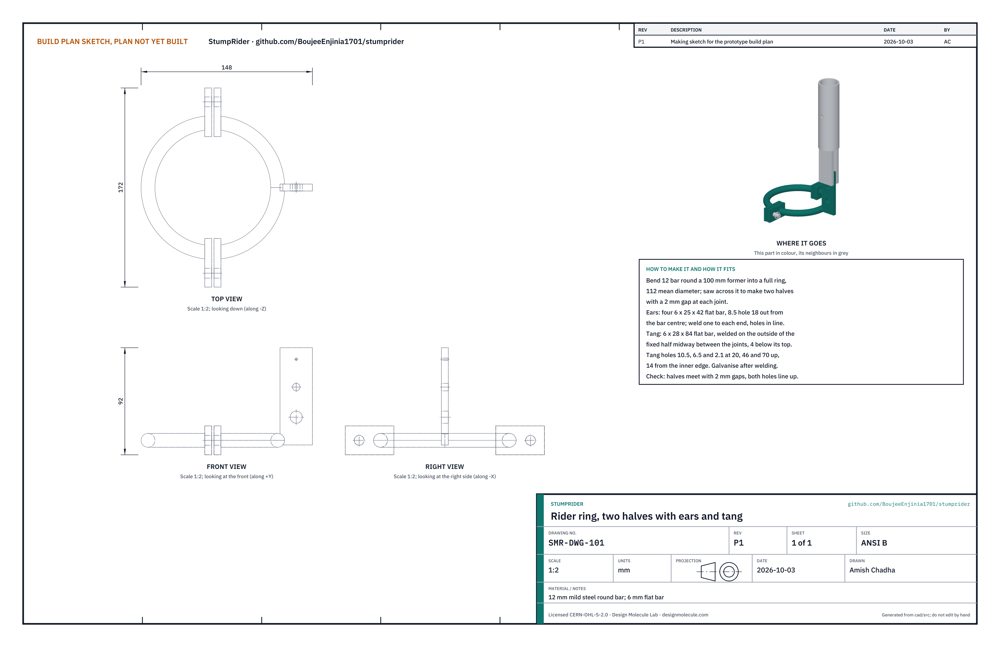

**What it is and what it is made from.** Two half rings of 12 mm mild steel round bar, 100 inside and 124 outside, each with a flat ear at both ends; a flat tang stands up from the outside of the fixed half. About 0.40 m of bar and 0.25 m of 6 x 30 flat bar.

**How to make it.**

1. Bend 360 of 12 bar round a 100 mm round former (a pipe or a turned block) into a full ring, ends meeting.
2. Mark two points opposite each other and saw across the ring at both, taking out 2 at each cut so the halves meet with a 2 gap.
3. Cut four ears of 6 x 25 flat bar, 42 long. Drill an 8.5 hole in each, 18 out from where the bar centre will sit.
4. Clamp the halves on a flat plate with 2 spacers in the gaps. Weld one ear on the end of each half, faces flat to the joint, so each pair of ears faces the other with a 2 gap and the holes line up.
5. Cut the tang from 6 x 28 flat bar, 84 long. Drill 10.5, 6.5 and 2.1 holes on its centre line at 20, 46 and 70 from the end that will sit lowest.
6. Weld the tang upright on the outside of one half, midway between its ears, with its lower end 4 below the top of the bar and its flat faces square to the ring. This is the fixed half.
7. Grind the welds smooth inside the ring so it slides on a line. Send for galvanising with the other steel parts.

**How it fits the parts next to it.** The ears meet face to face; the hinge bolt goes through one pair and the gate pin through the other.

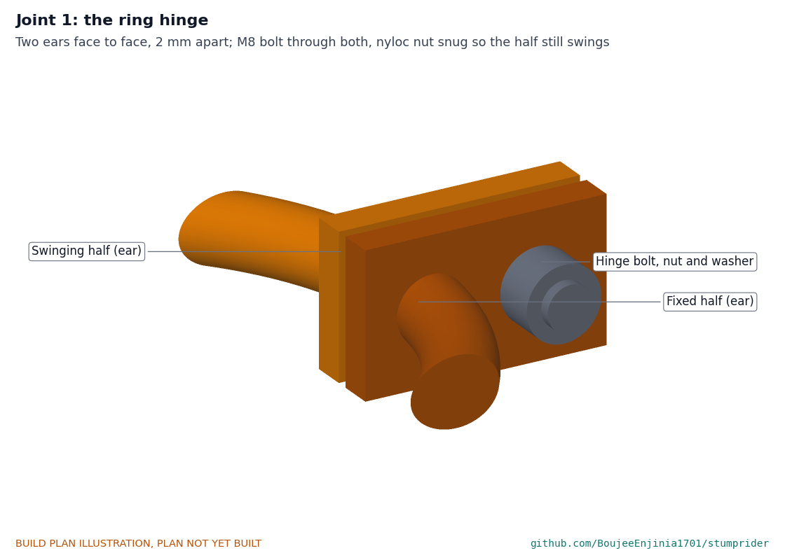

*Figure 3. The hinge: M8 bolt through both ears, nyloc nut snug.*

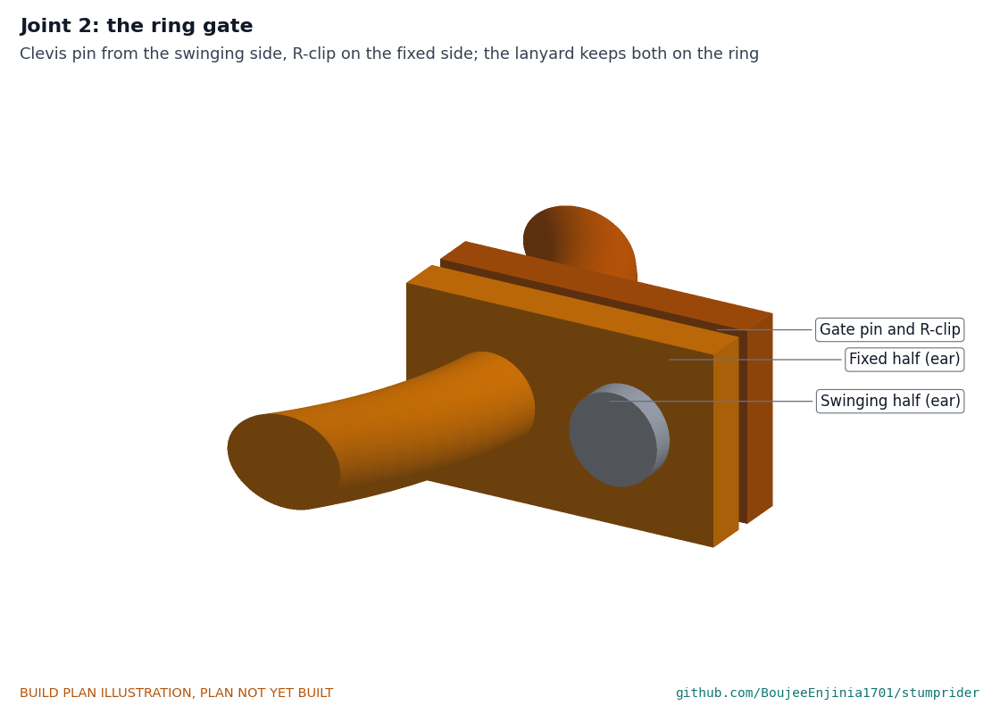

*Figure 4. The gate: clevis pin with R-clip and lanyard.*

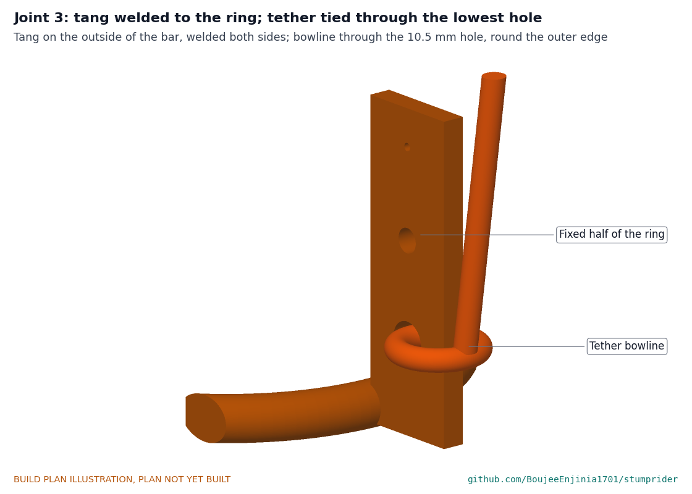

*Figure 5. The tang, welded on the outside of the bar.*

**Check before moving on.** Both pairs of holes line up with an 8 rod through them; the gaps are 2; the tang stands square; an 8 drill passes the ring's inside without catching on a weld.

### 3.2 Pole head (4)

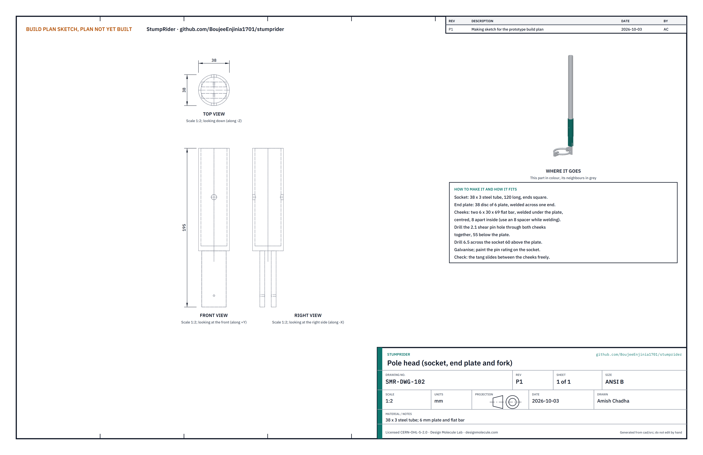

**What it is and what it is made from.** A steel socket that slips over the bottom of the pole, closed by an end plate, with two fork cheeks under it. 38 x 3 steel tube, 6 plate and 6 x 30 flat bar.

**How to make it.**

1. Cut 120 of 38 x 3 tube with square ends; cut a 38 disc from 6 plate.
2. Weld the disc across one end of the tube.
3. Cut two cheeks of 6 x 30 flat bar, 69 long.
4. Hold the cheeks under the disc with an 8 thick spacer between them, centred on the disc and square to it, and weld them to the disc.
5. Clamp the cheeks together on the spacer and drill a 2.1 hole through both, 55 below the disc, on their centre line.
6. Drill a 6.5 hole straight across the tube, 60 above the disc.
7. Galvanise. Paint "302 N PIN ONLY" on the tube.

**How it fits the parts next to it.** The pole goes into the tube until it rests on the disc and is held by a lock pin. The cheeks straddle the ring's tang with 1 clear each side; the tang's top stops 45 below the disc, so it never touches it.

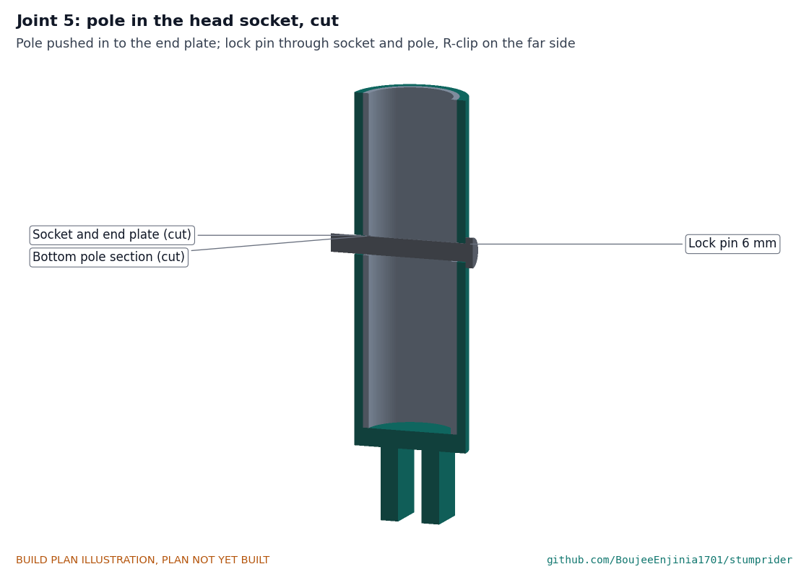

*Figure 6. Pole in the socket, lock pin through both.*

**Check before moving on.** The pole slides in by hand and seats on the disc; the tang slides between the cheeks without binding; a 2 rod passes cheek, tang and cheek holes when lined up.

### 3.3 Shear pins (5)

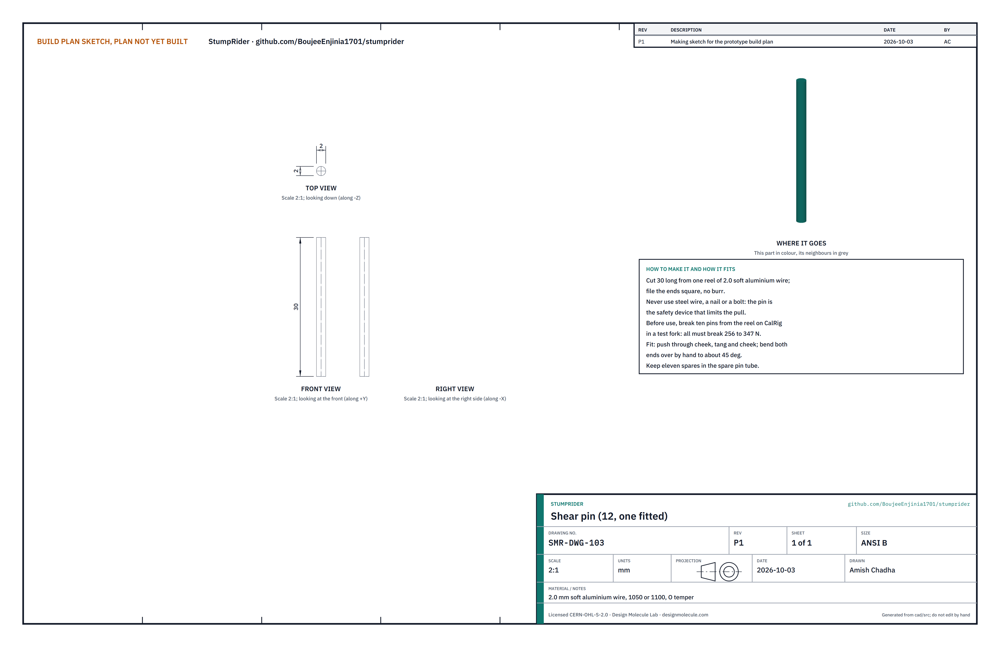

**What it is and what it is made from.** Short lengths of 2.0 soft aluminium wire (1050 or 1100 alloy, soft temper). They are the safety link: each breaks at about 300 N (30 kg pull).

**How to make it.**

1. Take all pins from one reel of wire and label the reel.
2. Cut twelve pins 30 long; file the ends square, no burr.
3. Calibrate the reel before any pin is used (section 5, check 1).
4. Put eleven in the spare pin tube.

**How it fits the parts next to it.** Pushed through cheek, tang and cheek; both ends bent over by hand to about 45 degrees so it cannot fall out. It is never replaced by a nail, a bolt or steel wire.

**Check before moving on.** The reel has passed calibration; every pin is straight and the same length.

### 3.4 Pole sections (6)

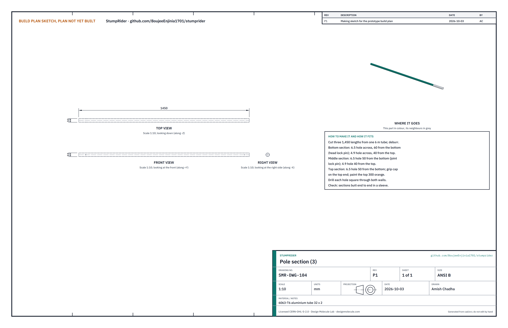

**What it is and what it is made from.** Three 1,450 lengths of 6063-T6 aluminium tube, 32 outside, 2 wall, cut from one 6 m length.

**How to make it.**

1. Cut three 1,450 lengths; deburr inside and out.
2. Bottom section: drill 6.5 straight across, 60 from the bottom end (head lock pin), and 4.9 across, 40 from the top end (rivets).
3. Middle section: 6.5 across, 50 from the bottom end (joint lock pin), and 4.9 across, 40 from the top end.
4. Top section: 6.5 across, 50 from the bottom end. Paint the top 300 orange.
5. Drill every hole square through both walls, with the tube in a vee block.

**How it fits the parts next to it.** The sections butt end to end inside the sleeves (3.5); the grip cap goes on the top of the top section.

**Check before moving on.** All three are the same length within 2; every hole goes straight through.

### 3.5 Joint sleeves (7)

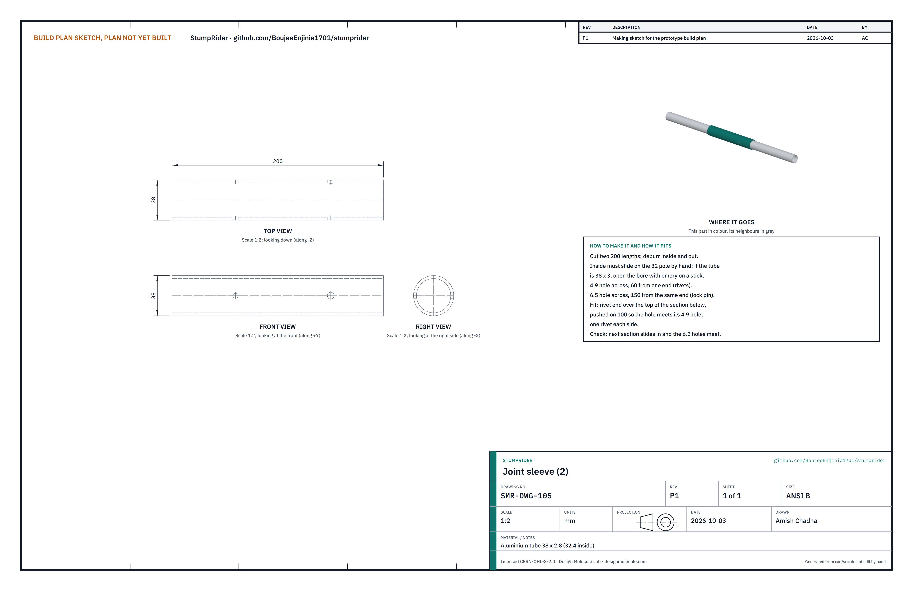

**What it is and what it is made from.** Two 200 lengths of aluminium tube, 38 outside and 32.4 inside, so the pole slides in by hand.

**How to make it.**

1. Cut two 200 lengths; deburr.
2. If the tube is 38 x 3 (32 inside), open the bore with emery cloth on a stick until a pole section slides in by hand.
3. Drill 4.9 across, 60 from one end (rivets), and 6.5 across, 150 from the same end (lock pin).

**How it fits the parts next to it.** The rivet end goes 100 over the top of the bottom (or middle) section and is fixed with two rivets, one each side. The next section slides into the free end until it butts and is held by a lock pin.

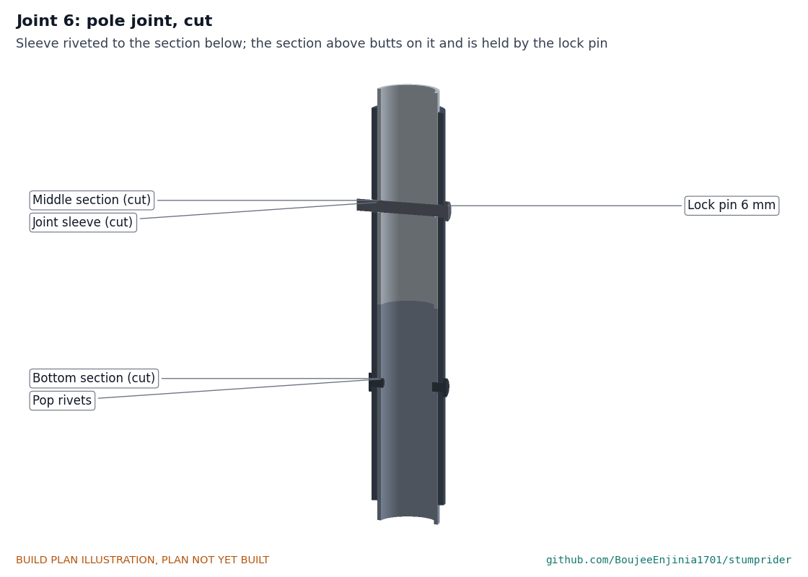

*Figure 7. Pole joint: sleeve riveted below, pinned above.*

**Check before moving on.** The next section slides in and its 6.5 hole lines up with the sleeve's.

### 3.6 Float winder (12)

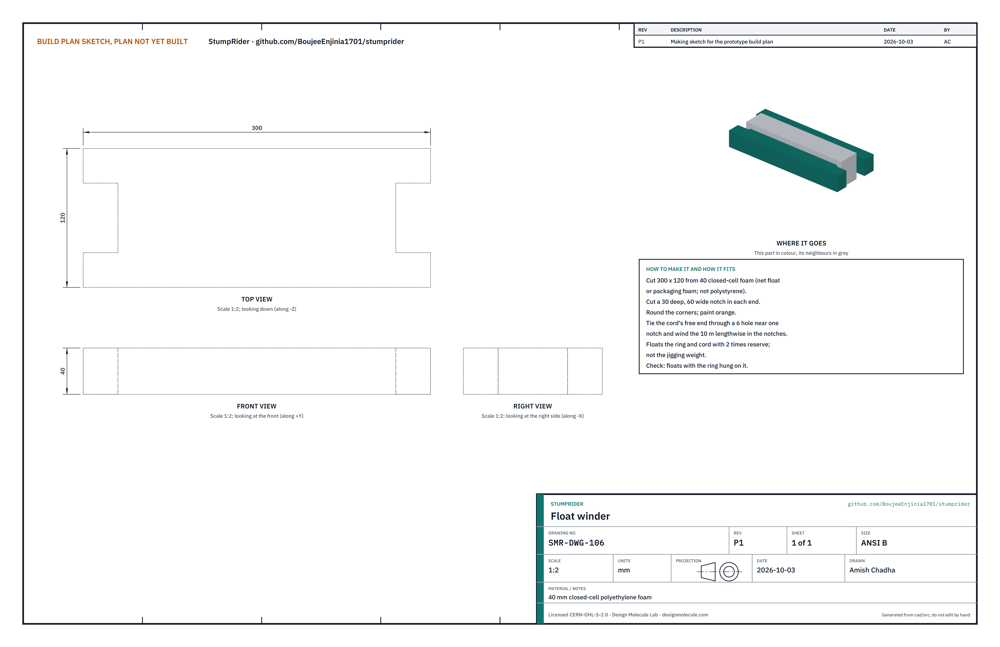

**What it is and what it is made from.** A flat winder for the tether cord, 300 x 120 cut from 40 closed-cell polyethylene foam (net-float or packaging foam, never polystyrene).

**How to make it.**

1. Cut the 300 x 120 blank with a sharp knife.
2. Cut a notch 30 deep and 60 wide in each end.
3. Round the corners; paint orange.
4. Push a 6 hole through near one notch for the cord's end.

**How it fits the parts next to it.** The cord is wound lengthwise through the notches; the spare pin tube is tied to it.

**Check before moving on.** With the ring hung on it in a bucket of water, it floats.

### 3.7 Jigging weight (14)

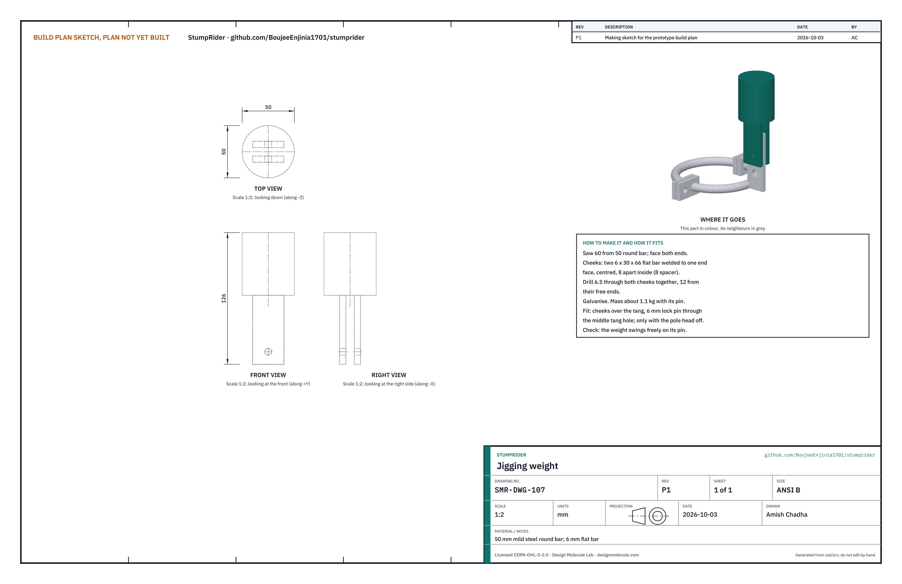

**What it is and what it is made from.** A 1.1 kg steel weight with a fork that pins to the ring's tang. 50 round bar and 6 x 30 flat bar.

**How to make it.**

1. Saw 60 from 50 round bar; face both ends flat.
2. Cut two cheeks of 6 x 30 flat bar, 66 long.
3. Weld them to one end face, centred, with an 8 spacer between them.
4. Clamp on the spacer and drill 6.5 through both, 12 from their free ends.
5. Galvanise.

**How it fits the parts next to it.** With the pole head off, the cheeks go over the tang and a lock pin goes through the tang's middle hole.

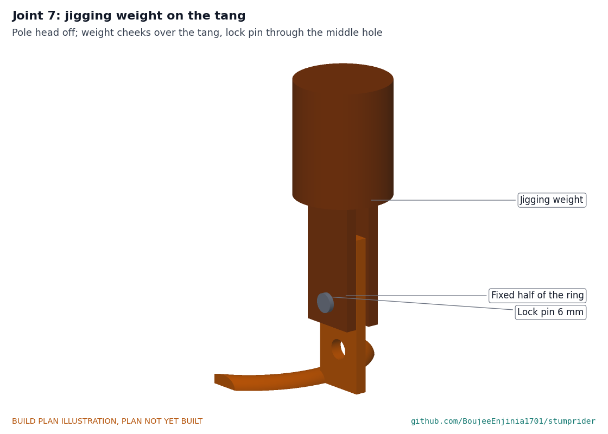

*Figure 8. The jigging weight pinned to the tang.*

**Check before moving on.** The weight swings freely on its pin and clears the tether knot.

### 3.8 Gunwale crutch frame (15)

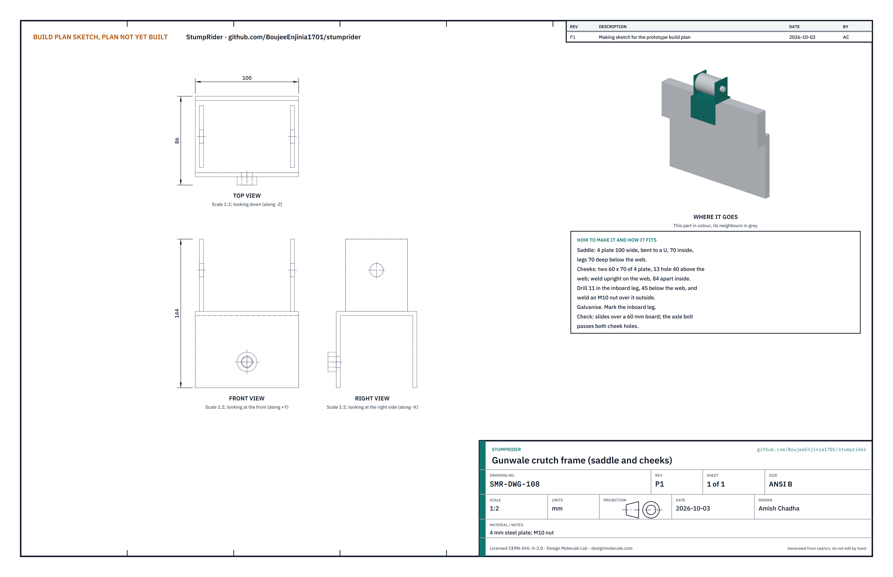

**What it is and what it is made from.** A U saddle that sits over the gunwale, with two cheeks that carry the roller. 4 steel plate and an M10 nut.

**How to make it.**

1. Cut a strip of 4 plate 100 wide and 218 long. Bend it to a U, 70 inside, with legs 70 deep below the web.
2. Cut two cheeks 60 x 70 from 4 plate; drill 13 in each, centred across, 40 above where it will sit on the web.
3. Weld the cheeks upright on the web, 84 apart inside, holes in line.
4. Drill 11 in one leg, 45 below the web, centred; weld an M10 nut over it on the outside. This is the inboard leg; mark it.
5. Galvanise.

**How it fits the parts next to it.** The web sits on the top of the gunwale, the outboard leg against the outside of the canoe; the clamp screw's pad bears on the inside face.

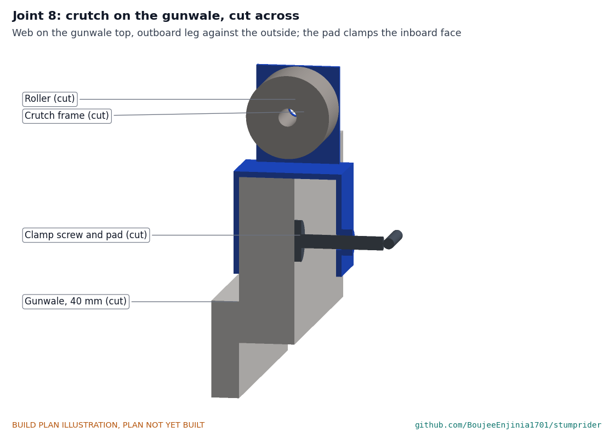

*Figure 9. The crutch on a 40 mm gunwale.*

**Check before moving on.** It slides over a 60 board; an M12 bolt passes both cheek holes.

### 3.9 Crutch roller (16)

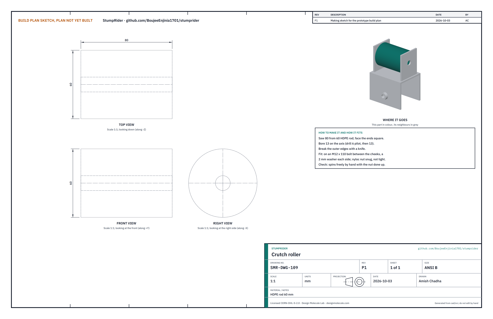

**What it is and what it is made from.** An 80 length of 60 HDPE rod, bored to run on an M12 bolt.

**How to make it.**

1. Saw 80 from the rod; face the ends square.
2. Drill a 6 pilot on the axis, then open it to 13.
3. Take the sharp outer edges off with a knife.

**How it fits the parts next to it.** On an M12 x 110 bolt between the cheeks, with a 2 washer each side; the nyloc nut is snug, not tight.

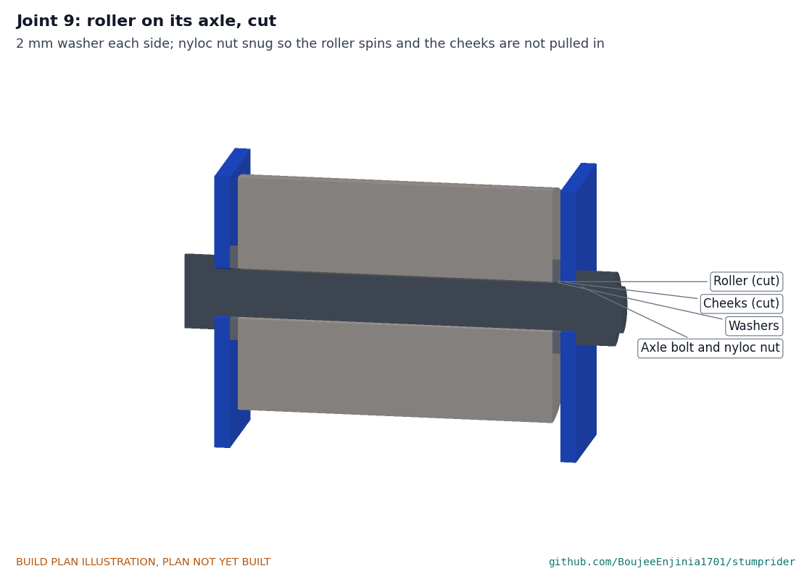

*Figure 10. Roller, washers and axle bolt.*

**Check before moving on.** It spins freely by hand with the nut done up.

### 3.10 Crutch clamp screw (17)

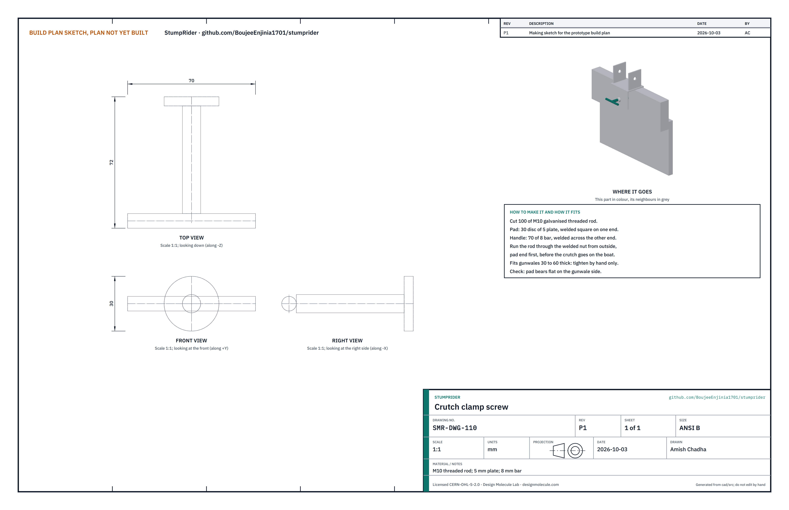

**What it is and what it is made from.** 100 of M10 galvanised threaded rod with a 30 pad on one end and a 70 handle across the other.

**How to make it.**

1. Cut 100 of M10 rod.
2. Weld a 30 disc of 5 plate square on one end (grind the zinc off the weld area first, outdoors).
3. Weld 70 of 8 round bar across the other end. Touch up the welds with zinc-rich paint.

**How it fits the parts next to it.** It runs through the nut on the crutch's inboard leg, pad end in first.

**Check before moving on.** It turns by hand through the full 30 to 60 range.

### 3.11 Hook head (21)

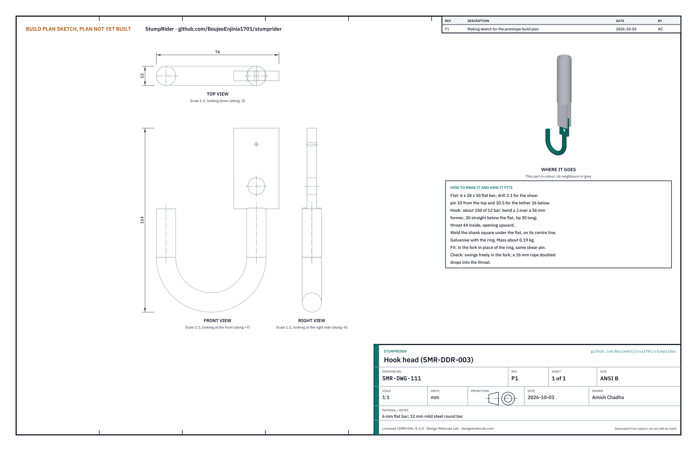

**What it is and what it is made from.** A J hook of 10 mm steel round bar welded to a short flat with the same holes as the ring's tang, so it pins into the same fork. It weighs about 0.2 kg.

**How to make it.**

1. Cut 60 of 6 x 28 flat bar. Drill a 10.5 hole 12 from one end and a 2.1 hole 50 from the same end, on the centre line.
2. Cut about 220 of 10 round bar. Bend one end round a 50 pipe held in the vice into a J: the legs end up 60 apart, centre to centre, with a 50 gap between them, and the short leg 35 long.
3. Weld the long leg to the flat, in line with it, running 10 up the flat's end with the 10.5 hole; weld both sides.
4. Galvanise with the other steel parts.

**How it fits the parts next to it.** The fork goes over the flat in place of the ring's tang, held by a calibrated shear pin; the tether's bowline is moved to the 10.5 hole so the hook comes back if the pin breaks.

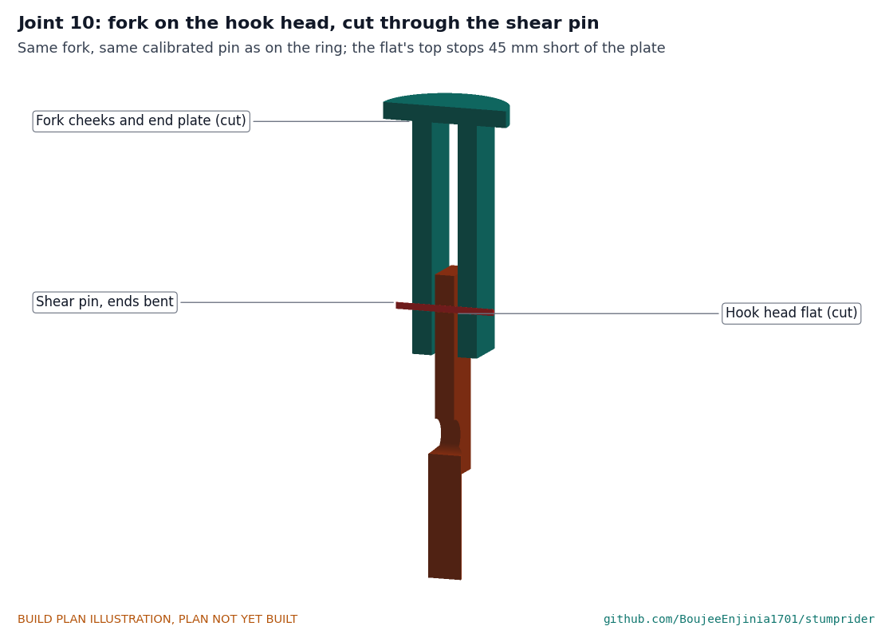

*Figure 11. The hook head in the fork, held by the same shear pin.*

**Check before moving on.** The fork slides over the flat freely; a 2 rod passes cheek, flat and cheek; the J's gap takes two fingers.

### 3.12 Bamboo local variant pole

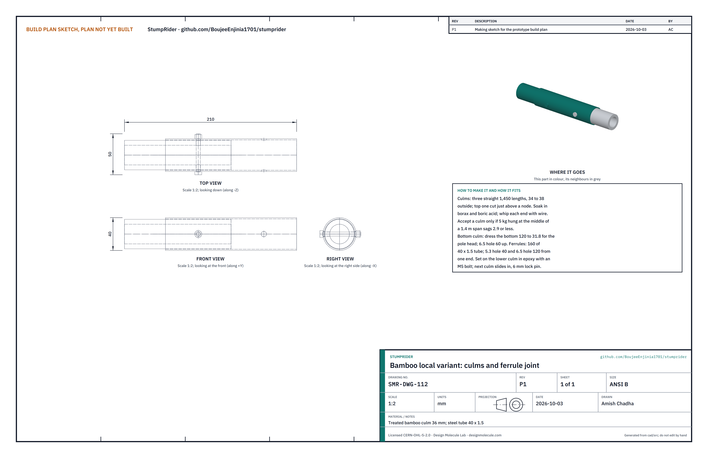

**What it is and what it is made from.** A pole of three bamboo culms in place of the aluminium sections, sleeves, rivets and grip cap (`bom/bom-bamboo-variant.csv`). Straight seasoned culms about 36 across (34 to 38), 1,450 long; two ferrules of 40 x 1.5 steel tube, 160 long; two M5 stainless bolts with nyloc nuts; epoxy. The ring, pole head, pins, hook head, tether and float are the same as in the aluminium kit.

**How to make it.**

1. Choose culms that are straight and free of splits. Bend-test each: rest it on two supports 1.4 apart and hang 5 kg at the middle. Use it only if it sags 2.9 or less.
2. Cut three 1,450 lengths. Cut the top one just above a node so the node closes its end.
3. Soak the culms in a borax and boric acid solution for a week, then dry them in the shade. Whip each end with galvanised wire.
4. Dress the bottom 120 of the bottom culm down to 31.8 with a rasp and file until it slides into the pole head. Drill 6.5 across it, 60 from the bottom end.
5. Cut two 160 lengths of 40 x 1.5 tube; deburr. Drill 5.3 across, 40 from one end, and 6.5 across, 120 from the same end. Paint with zinc-rich paint.
6. Push a ferrule 80 onto the top of the bottom culm, bolt end first, with epoxy on the culm. Drill 5.3 through the culm through the ferrule's hole and fit an M5 bolt and nyloc nut. Do the same on the middle culm.
7. Push the next culm into each ferrule until it butts, and drill 6.5 through it through the ferrule's lock pin hole.

**How it fits the parts next to it.** The bottom culm goes into the pole head and is held by the head lock pin; the culms are joined by the ferrules and the same 6 mm lock pins as the aluminium pole.

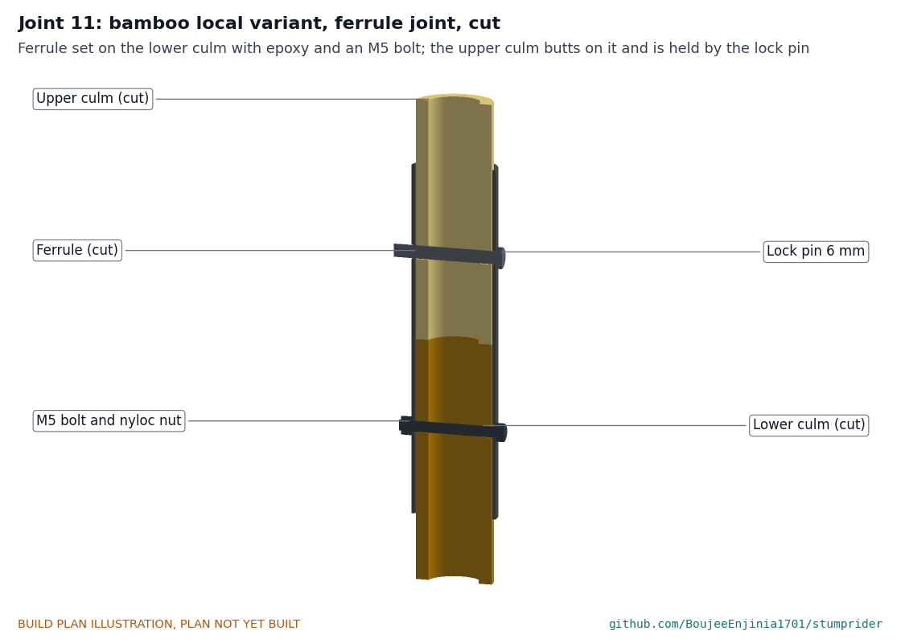

*Figure 12. Ferrule joint: bolted and glued below, pinned above.*

**Check before moving on.** Every culm passed the bend test; the joints have no play you can feel; the longest piece packs under 1.6 m.

### 3.13 Bought components

- **Hinge bolt (2):** M8 x 30 stainless bolt, nyloc nut and two washers.
- **Gate pin (3):** 8 x 30 stainless clevis pin with an R-clip; tie a 300 length of 3 cord through the R-clip and round the gate ear.
- **Pop rivets (8):** four 4.8 stainless blind rivets, grip 4 to 6.
- **Lock pins (9):** four 6 x 50 stainless clevis pins with R-clips; tie a short lanyard to each.
- **Grip cap (10):** rubber cap for 32 tube, 30 deep.
- **Tether cord (11):** 10 m of 6 braided polyester; heat-seal both ends.
- **Spare pin tube (13):** a small capped vial about 14 across and 80 long; tie it to the winder.

## 4. Putting it together

### Step 1: hinge the ring halves

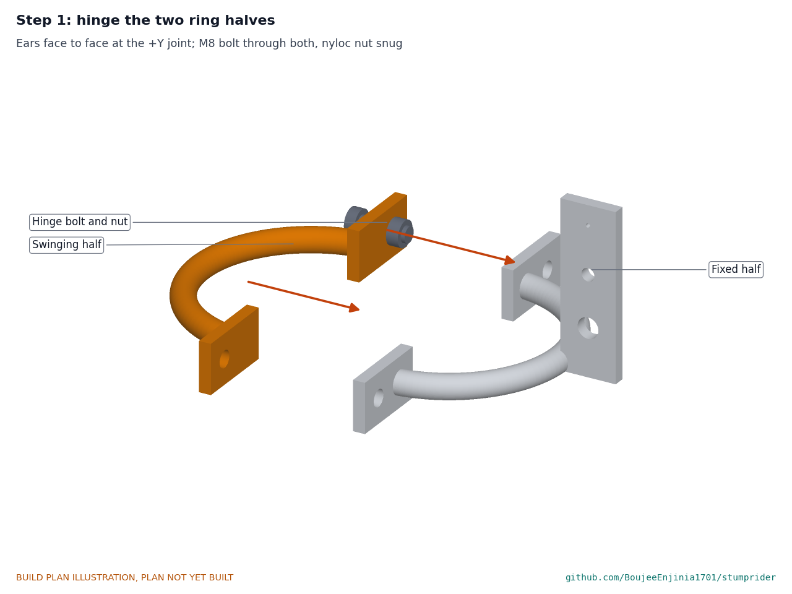

Lay the halves together with the hinge ears face to face. Push the M8 bolt through, add the nyloc nut and tighten until the swinging half still moves under its own weight.

### Step 2: close the gate

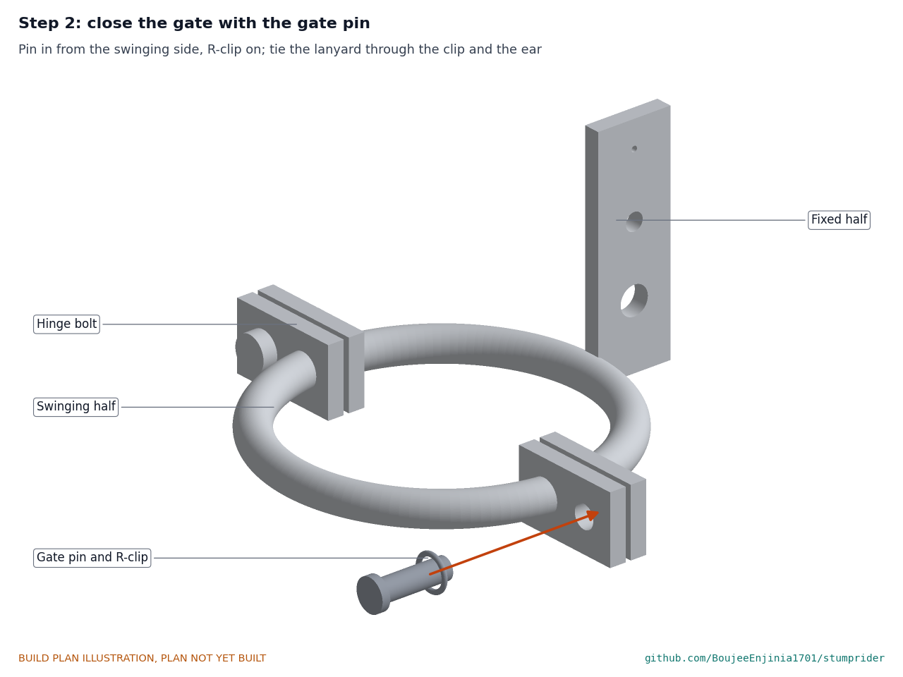

Swing the halves shut, push the gate pin in from the swinging side and fit the R-clip. Tie the lanyard through the R-clip and round the ear.

### Step 3: tie on the tether

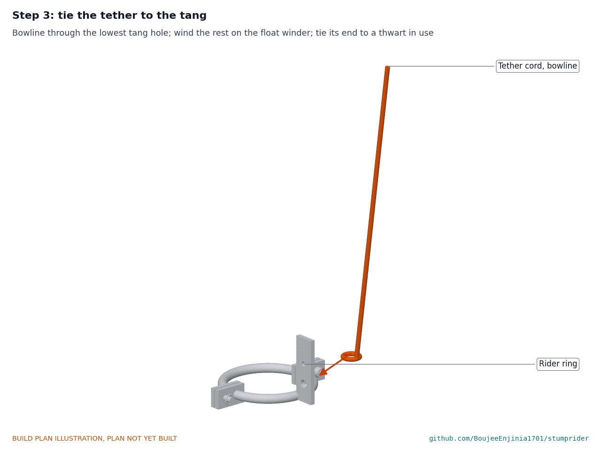

Tie the cord's end through the tang's lowest hole with a bowline round the tang's outer edge. Wind the rest on the float winder and tie the far end through the winder's hole.

### Step 4: rivet the sleeves

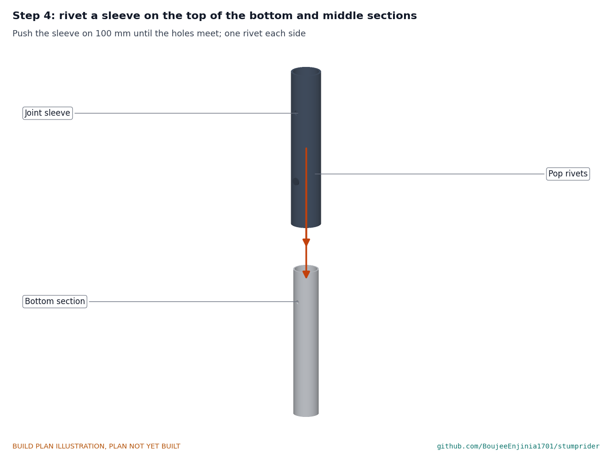

Push a sleeve 100 onto the top of the bottom section until the rivet holes meet; fit one rivet each side. Do the same on the middle section. Hold point: pull each sleeve by hand; it must not move.

### Step 5: fit the pole head

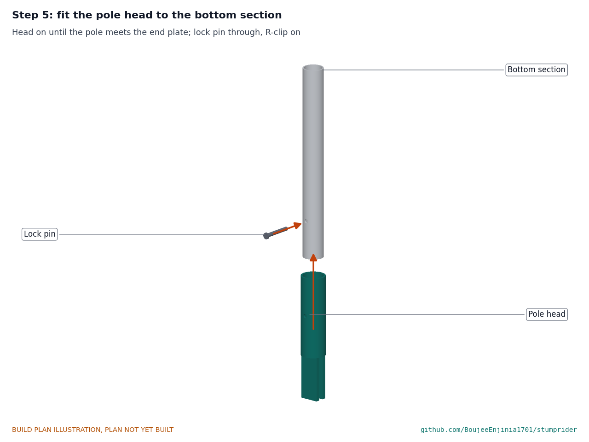

Push the head onto the bottom of the bottom section until the pole rests on the end plate. Fit a lock pin through and its R-clip.

### Step 6: join the sections

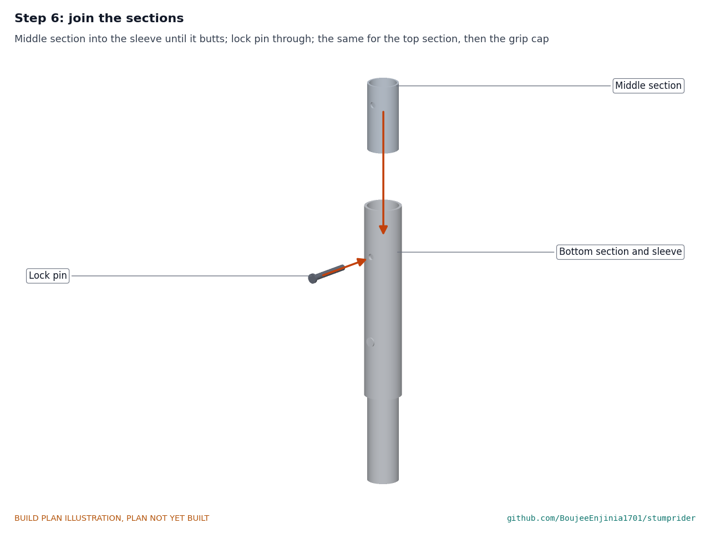

Push the middle section into the bottom section's sleeve until it butts; fit a lock pin. Push the top section into the middle sleeve the same way and fit a lock pin. Push the grip cap on the top.

### Step 7: fork on the tang, shear pin in

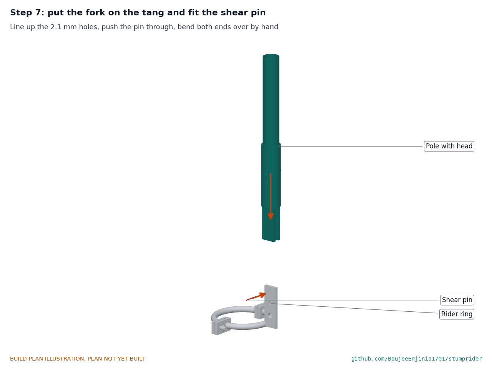

Slide the fork over the ring's tang, line up the 2.1 holes, push a calibrated shear pin through and bend both ends over by hand. Hold point: never fit anything but a calibrated pin.

### Step 8: fit the roller

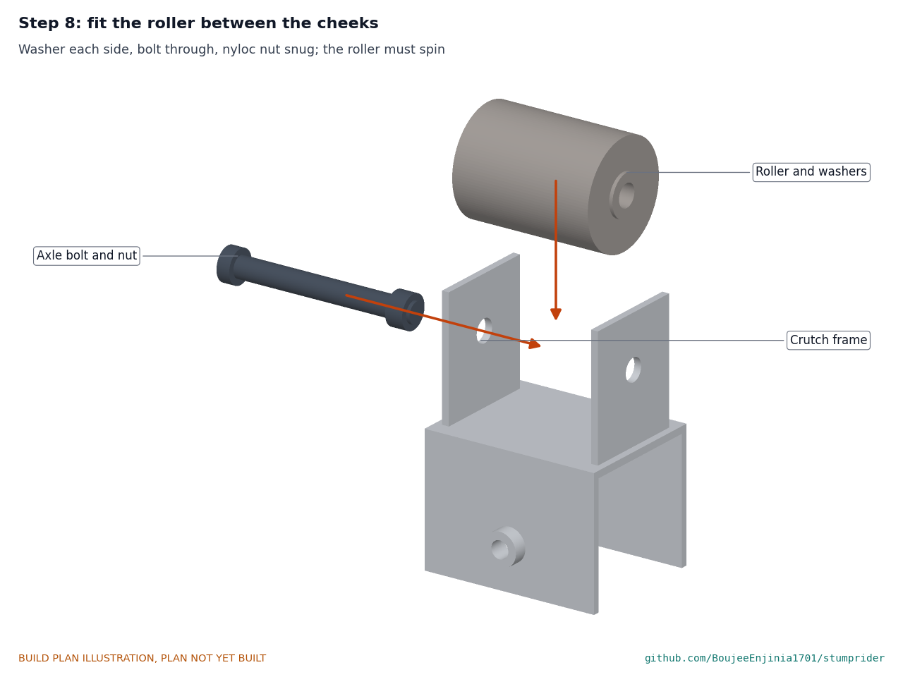

Put the roller between the cheeks with a washer each side, push the axle bolt through and do up the nyloc nut until it is snug; the roller must still spin.

### Step 9: fit the clamp screw

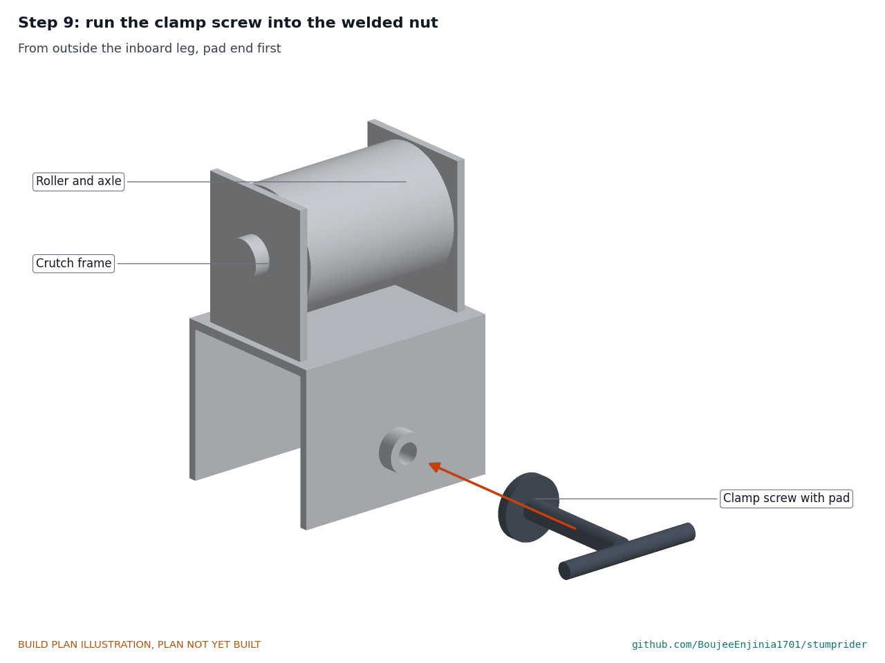

Run the clamp screw into the welded nut from outside the inboard leg, pad end first, until the pad is just inside the leg.

### Step 10: clamp the crutch on the canoe

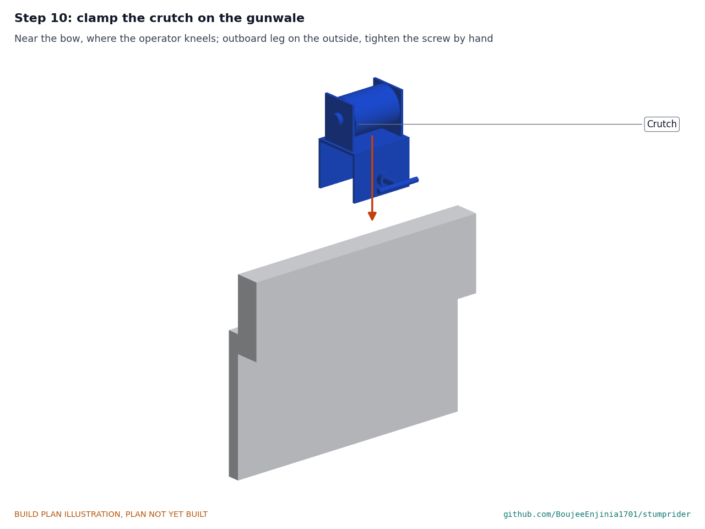

Near the bow, where the operator will kneel, set the web on the gunwale with the outboard leg against the outside. Tighten the clamp screw by hand. Hold point: the crutch must not move when pulled hard by hand. The crutch stays on the canoe as a fitting; it is not carried home with the kit.

### Step 11: jigging set-up (deep snags only)

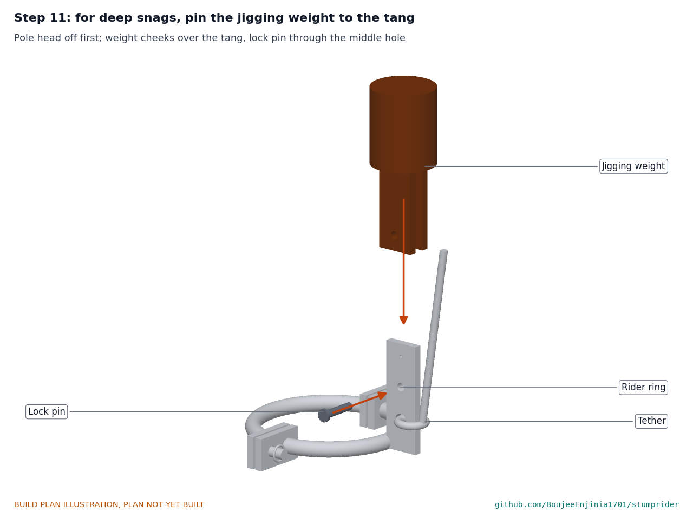

The jigging weight is kept at the landing and taken out only for a known deep set. Take out the shear pin and lift the pole head off the tang. Put the jigging weight's cheeks over the tang and fit a lock pin through the middle hole. Tie the tether's end to a thwart before working.

### Step 12: hook head (net wrapped round a branch)

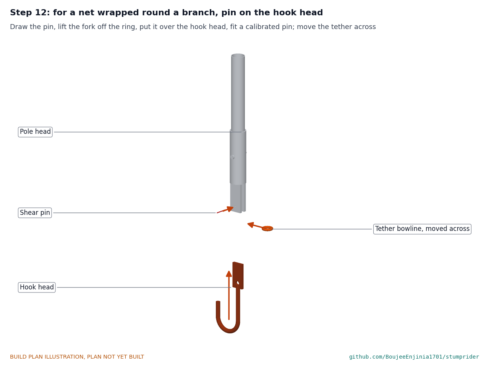

When the ring will not lift a net that has wrapped round a branch, bring the ring back up the line. Draw the shear pin, lift the fork off the ring's tang and put it over the hook head's flat; push a calibrated pin through and bend its ends. Untie the tether's bowline from the ring and tie it through the hook head's 10.5 hole. Reach down beside the net line, hook the bight of net where it goes round the branch and pull it back the way it wrapped, half a turn at a time, with the crew's line slack. Then change back to the ring and lift the net off. Hold point: the same rules apply as with the ring: kneel, slacken the line, and cut the net if the canoe heels.

## 5. First checks

*Table 2. First checks, listed here and recorded in a TRL 4 test report.*

| # | Check | Requirement | How | Pass when |
| --- | --- | --- | --- | --- |
| 1 | Pin calibration | R3 | Break ten pins from the reel in a test fork on CalRig, pulling slowly | All ten break between 256 and 347 N; otherwise change the wire diameter and repeat |
| 2 | Ring fit | R6 | Close the ring on lines of 4, 8, 12 and 16 mm; slide it 1 m along each | Closes on every line and slides without catching |
| 3 | Pole and joints | R2, R7 | Assemble, measure from 300 below the cap to the ring centre; pack the sections | At least 4.0 m; longest piece under 1.6 m; joints have no play you can feel |
| 4 | Release on a bench snag | R1, R3 | Ring on a rope hooked over a fixed log, crew rope at 30 N, pull up the pole on a spring balance | Rope lifts clear below the pin rating, or the pin breaks inside its band and the pole comes away cleanly |
| 5 | Mass | R7 | Weigh the kit carried to and from the canoe (without the crutch and the jigging weight), aluminium and bamboo | Recorded against R7 (4 kg) |
| 6 | Float | R7, R8 | Hang the ring and cord on the winder in water | Floats |
| 7 | Canoe heel | R3 | With the canoe moored in shallow, calm water, crew aboard in life jackets, pull the pole sideways from a fixed point ashore with a spring balance up to the pin rating; read the heel with an inclinometer | Heel at 347 N is 5 deg or less |
| 8 | Hook head on a bench wrap | R1 | Rope wrapped once round a fixed log, crew rope at 30 N; work it back with the hook head, then lift with the ring | The wrap comes back half a turn below the pin rating, or the pin breaks inside its band |
| 9 | Bamboo pole | R2, R7 | Bend-test every culm; assemble and repeat check 3 | Every culm sags 2.9 mm or less; reach and packed length as check 3 |

## 6. Safety stops

Work stops at each of these points and goes on only when everything listed is true.

- **S1, before welding:** working in the open, nothing galvanised in the weld zone, eye and hand protection on.
- **S2, before fitting any shear pin:** its reel has passed check 1; no other pin, nail, bolt or wire is in the kit.
- **S3, before taking the kit onto a canoe:** checks 2 to 6 passed; the crutch is clamped and pulled by hand; every person has a life jacket on.
- **S4, before the heel test (check 7) or any use on a snag:** the canoe is at least 7 m long with at least three crew (a smaller canoe class only once heel tests have set a pin for it), moored or in shallow, calm water; the operator kneels; the crew knows to slacken the line when the operator lifts and to cut the net if the canoe heels; nobody enters the water for any reason.
- **S5, after every pin break:** the operator is back in a kneeling position, the ring or hook head is recovered on its tether, and a calibrated pin is fitted before the next try.

## 7. Tools, skills and workspace

- Tools: hacksaw or cut-off grinder, rasp and files for bamboo, a 5 kg weight for the bend test, bench drill or hand drill with a vee block, drills from 2.1 to 13, a vice, a 100 mm round former, files and a flap disc, stick welder, pop rivet gun, sharp knife, tape and square, spring balance to 50 kg, bubble inclinometer.
- Skills: basic bending and welding of mild steel; drilling square through tube; tying a bowline.
- Workspace: an open-air workshop bench; a galvaniser for the steel parts (sent out once all welding is done); a calm, shallow mooring for check 7.

## 8. Where the numbers come from

- Model: `cad/src/model.py` (sizes, constructability checks), STEP files in `cad/step/`.
- Drawings: `cad/drawings/SMR-DWG-001` (general arrangement) and `SMR-DWG-101` to `SMR-DWG-112` (making sketches).
- Calculations: `docs/04-calcs/01-sizing.md` (SMR-CAL-001), `docs/04-calcs/sizing.py` and `docs/04-calcs/results.csv`.
- Bill of materials: `bom/bom.csv`; bamboo local variant `bom/bom-bamboo-variant.csv`.
- Pictures: `cad/src/build_plan_media.py`.
